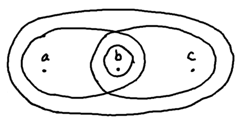

Related notes: [metric spaces](metric_spaces.html), [topology: bases and countability](topology_bases_countability.html)

23. We can define the **convergence** of sequences in a topological space as follows: $(x_n)$ converges to $a \in  X$ when every neighborhood of $a$ contains all but finitely many terms of the sequence. This definition is not generally useful since limits are not unique in general topological spaces. For example, in the three-point space depicted by

    

    The constant sequence of $b$'s converges to both $a$ and $c$ (in addition to $b$) because every neighborhood around $a$ or $c$ contains the whole sequence.

    Even weirder, under the trivial topology every sequence converges to every point. So there are topological spaces where the concept of convergent sequences is nonsensical. (There are two notions for discussing convergence in general topological spaces: nets and filters. I haven't had a reason to care about them yet, so I don't know anything about them)

24. The **order topology** on any totally ordered set $X$ is the one induced by the basis consisting of

     - all open intervals $(a, b)$ for $a, b \in X$
     - if there is a minimal element $z$, all half-open intervals $[z, x)$
     - if there is a maximal element $z$, all half-open intervals $(x, z]$

    This is a basis: it covers $X$ since if there's no maximal or minimal element, every $x \in X$ is contained in one open interval. If there's a minimal or a maximal element, it will be contained in one of the half-open intervals. Also, the intersection of two open intervals is either empty or another open interval, the intersection of an open interval and a half-closed interval is again either empty or open, and the intersection of two half-open intervals is either empty, another half-open interval, or an open interval. In all of these cases, the collection of all sets defined above is actually closed under non-disjoint intersection, so is a basis.
